# Hospital Appointment Scheduling and Management System

## Overview

This is a full-stack hospital management solution developed using the **Model-View-Controller (MVC)** architecture entirely in **ASP.NET Core MVC**. The system is designed to facilitate efficient scheduling and management of doctor appointments for a multi-specialty hospital. It provides role-based functionalities for **Admins**, **Doctors**, and **Patients**, including appointment booking, scheduling, tracking, and patient record management.

## Technologies Used

- **Language:** C#
- **Framework:** ASP.NET Core MVC
- **ORM:** Entity Framework Core
- **Database:** SQL Server
- **Architecture:** MVC (Monolithic)
- **IDE:** Visual Studio 2022 Community Edition
- **Version Control:** Git/GitHub

## Features

### Admin Functionality
1. **Dashboard:**
   - Overview of appointments (Pending, Approved, Completed).
   - Summary of active doctors and patients.
2. **Doctor Management:**
   - Add, edit, or remove doctor profiles.
   - Assign specializations and availability timings.
3. **Patient Management:**
   - View and manage patient records.
   - View appointment history.
4. **Appointment Management:**
   - View, approve, or cancel scheduled appointments.

### Doctor Functionality
1. **Dashboard:**
   - List of upcoming approved appointments.
   - View patient details and appointment history.
2. **Appointment Status:**
   - Mark appointments as Completed or Cancelled.
   - Add diagnosis notes or prescriptions.

### Patient Functionality
1. **Registration & Login:**
   - Secure registration with validation.
2. **Appointment Booking:**
   - Select department, doctor, and preferred time slot.
   - View booking status.
3. **Appointment History:**
   - Track past and upcoming appointments.

## Deliverables

- Fully functional MVC-based appointment management application.
- SQL Server database with normalized schema and relational integrity.
- Source code hosted on GitHub.
- Input validation on all forms.
- Secure login with role-based access (Admin, Doctor, Patient).
- Exception handling and logging implemented.

# PREVIEW
## Frontend

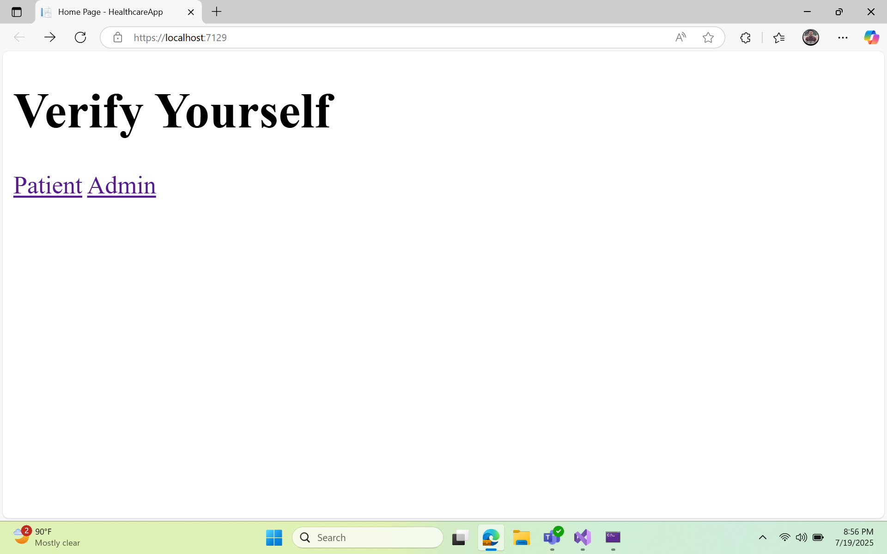

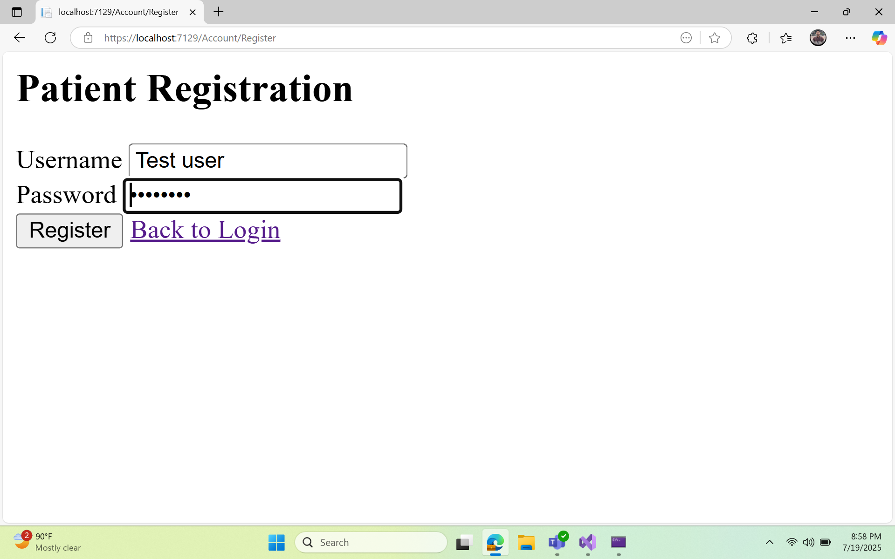

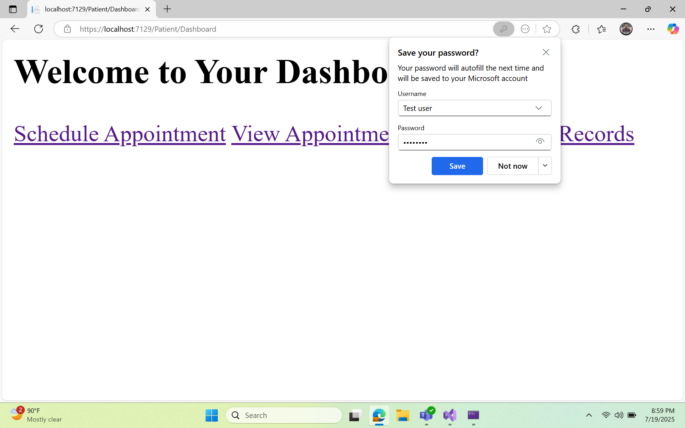

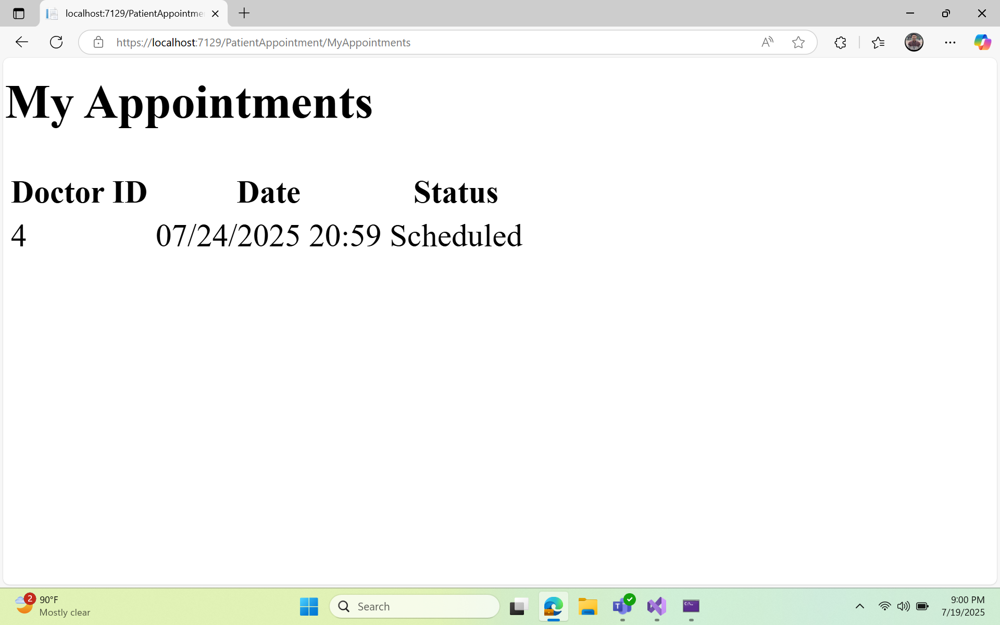

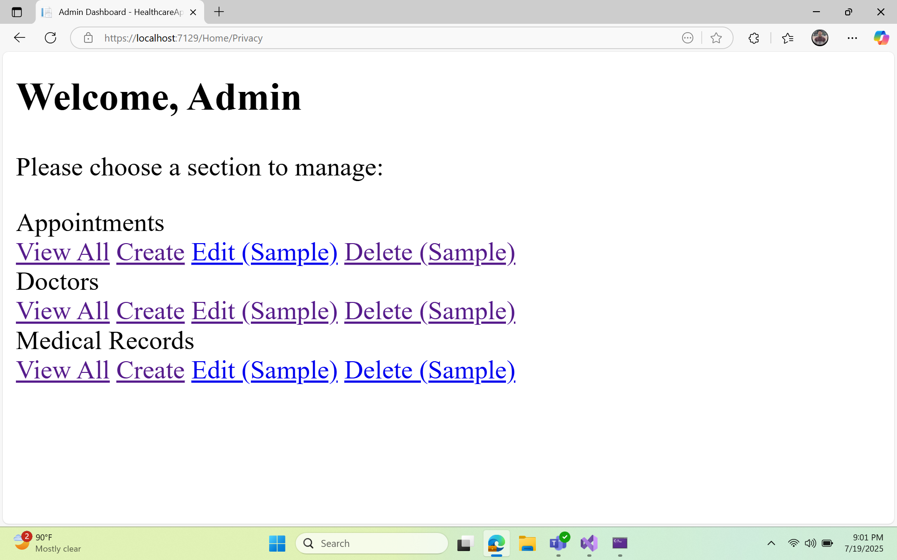

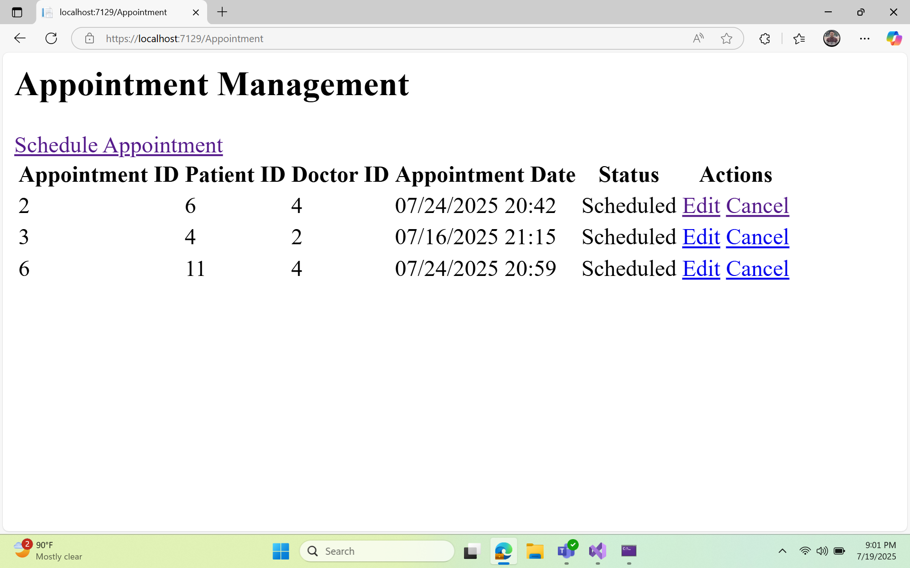

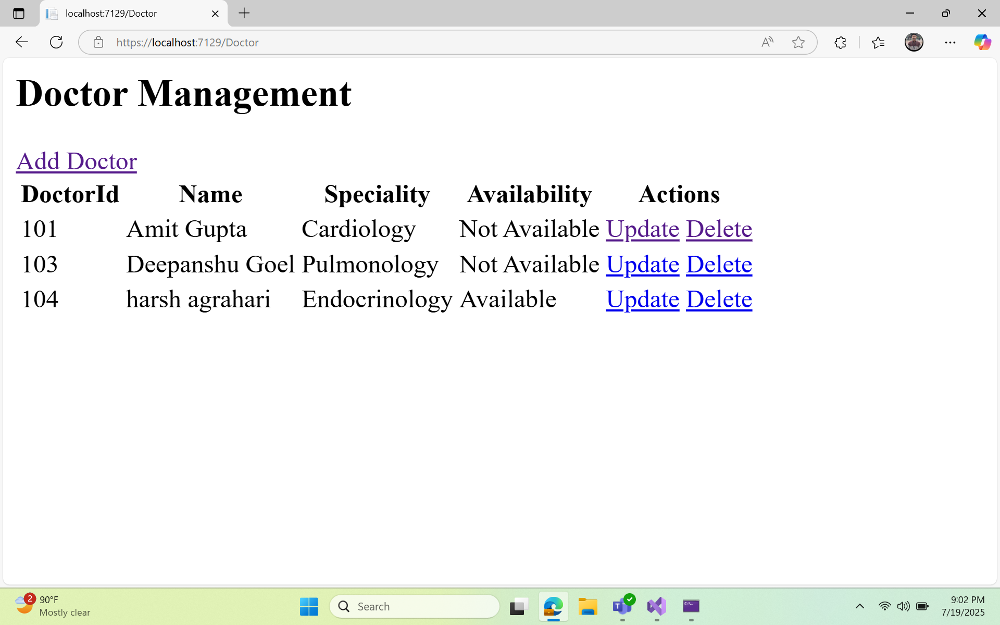

## Backend

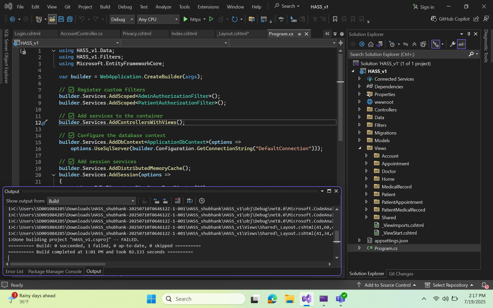
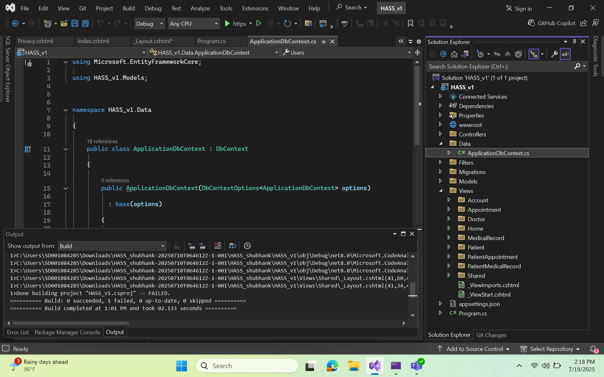
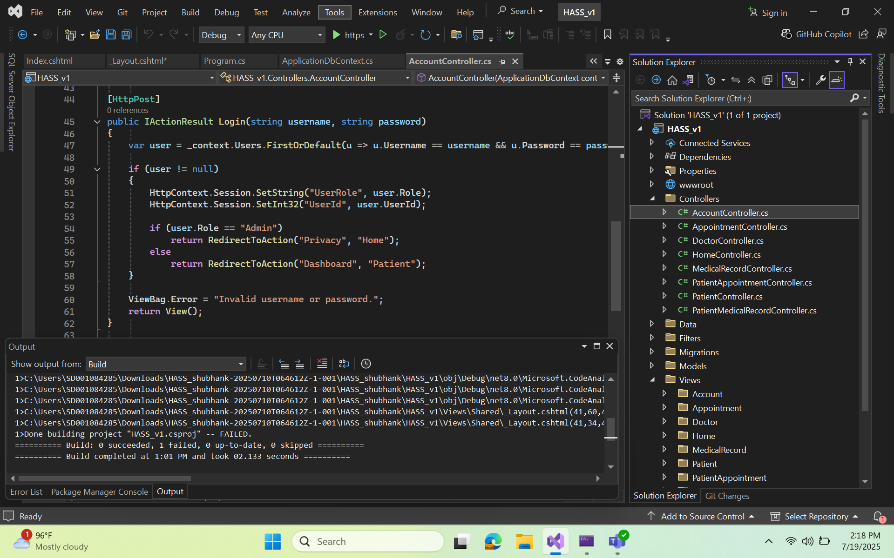
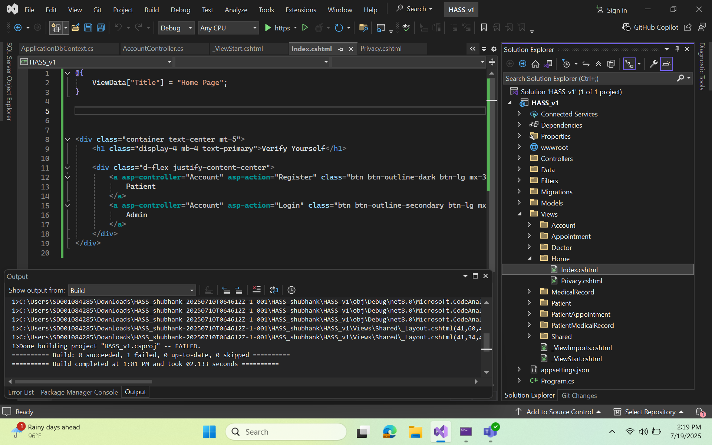
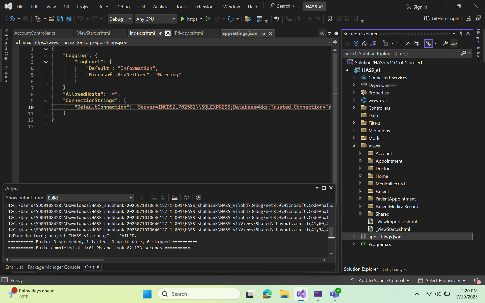
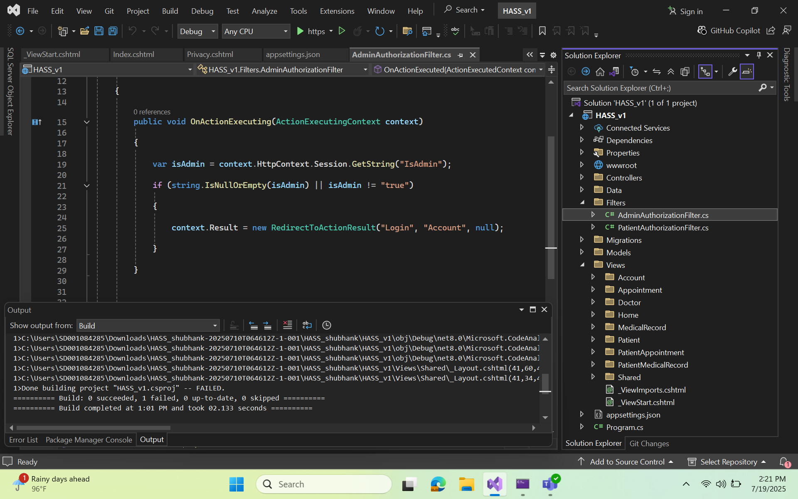

## Database

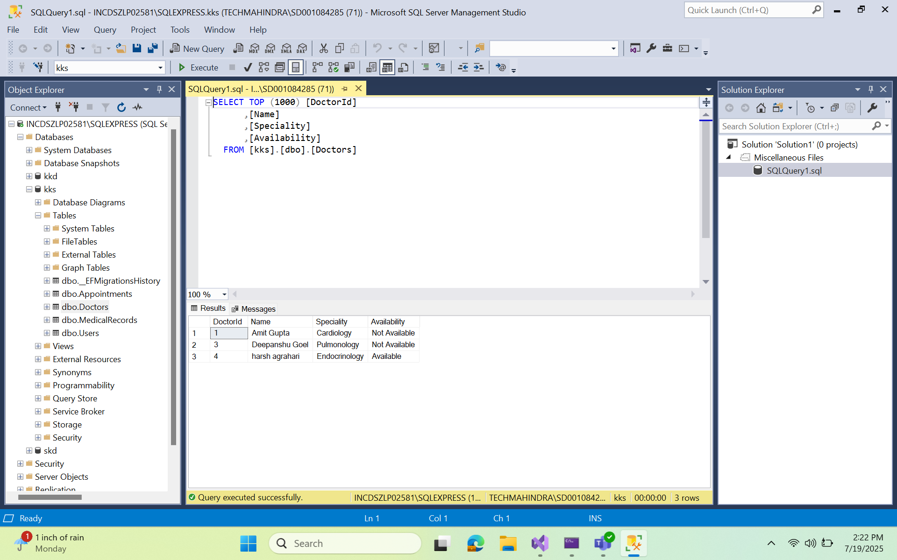
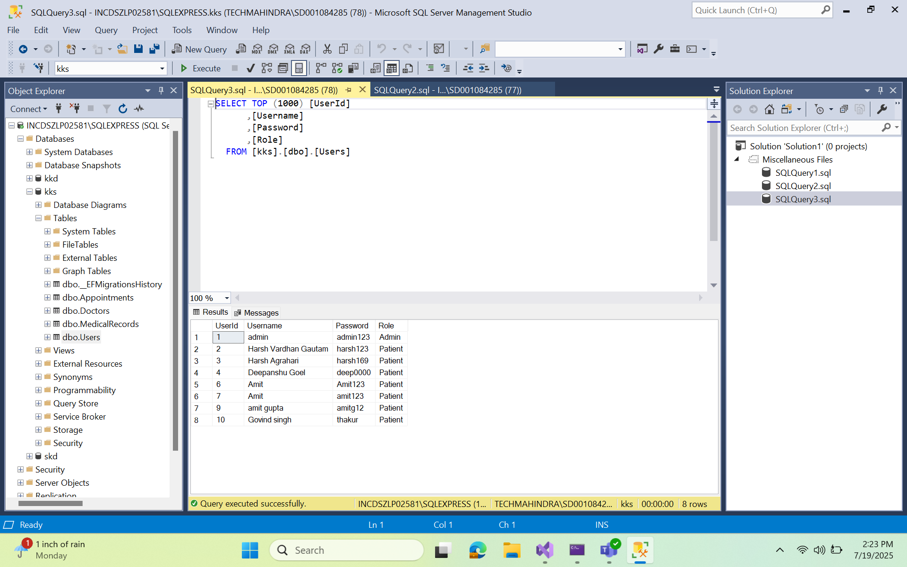

 
