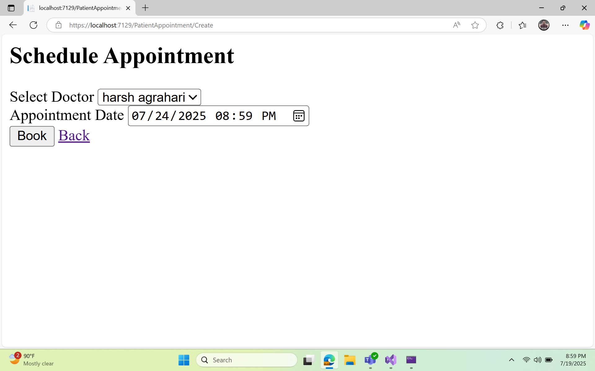

<!-- which  -->
# Vehicle Service Management System
 
##  Overview

This project is an end-to-end multi-tiered web-based solution for managing vehicle services. It is designed for Prime Automobiles Pvt. Ltd., a car sales and service company based in Pune, to track service history of sold vehicles and initiate scheduled servicing with customers. The system includes functionalities for both Admin and Service Advisor roles.


## Technologies Used
### Back-End
- **Programming Language:** C#
- **Frameworks:** ASP.NET Core MVC, ASP.NET Core Web API, Entity Framework
- **Database:** SQL Server
- **Architecture:** Microservices

### Front-End
- **Framework:** Angular
- **Technologies:** HTML5, CSS3, Bootstrap

### Tools
- **IDE:** Visual Studio Community Edition
- **Version Control:** GIT
- **Package Manager:** Node.js/NPM


## Features

### Admin Functionality
1. **Dashboard:**
   - List of vehicles due for servicing in the current week.
   - List of vehicles currently under servicing.
   - List of vehicles serviced with status information.
2. **Service Scheduling:**
   - Schedule a vehicle for servicing with a selected Service Advisor.
3. **Service Completion:**
   - Print invoice, process payment, and dispatch after service completion.
4. **Master Data Management:**
   - Create, update, delete, and search for Vehicles, Customers, Service Representatives, and Work Items (e.g., Engine Oil, Fuel Filter, Service Charges).

### Service Advisor Functionality
1. **Dashboard:**
   - List of vehicles scheduled for servicing.
2. **Service Recording:**
   - Add items to the Bill of Material (e.g., Oil change, Wheel alignment) and complete the service record.
   - Pre-decided costs for items which cannot be changed by Service Advisors.

## Deliverables
- Implementation of all functionalities as per the business requirements and scope.
- Complete application source code on GitHub.
- Deployed and working application hosted on a cloud environment.
- Unit tests and automated functional tests for all functionalities.
- Use of continuous integration toolchain (optional).
- Hosting on an Azure cloud platform (optional).
- Validation for all input fields based on business rules.
- Implementation of appropriate security features (secure coding, authentication/authorization).
- Appropriate exception handlers.


## Setup Instructions

1. **Clone the Repository:**
   ```bash
   git clone https://github.com/your-repo/vehicle-service-management.git
   cd vehicle-service-management
   ```

2. **Backend Setup:**
   - Open the solution in Visual Studio.
   - Restore NuGet packages.
   - Update database connection string in `appsettings.json`.
   - Run migrations to setup the database:
     ```bash
     Update-Database
     ```

3. **Frontend Setup:**
   - Navigate to the `ClientApp` directory.
   - Install Node.js dependencies:
     ```bash
     npm install
     ```
   - Build and run the Angular application:
     ```bash
     ng serve
     ```

4. **Running the Application:**
   - Start the ASP.NET Core Web API project from Visual Studio.
   - Open a browser and navigate to `http://localhost:4200` to access the application.

## Contributing

1. **Fork the repository**
2. **Create a new branch** (`git checkout -b feature-branch`)
3. **Make your changes**
4. **Commit your changes** (`git commit -am 'Add new feature'`)
5. **Push to the branch** (`git push origin feature-branch`)
6. **Create a new Pull Request**


# PREVIEW
## Frontend





## Backend


## Database


 
